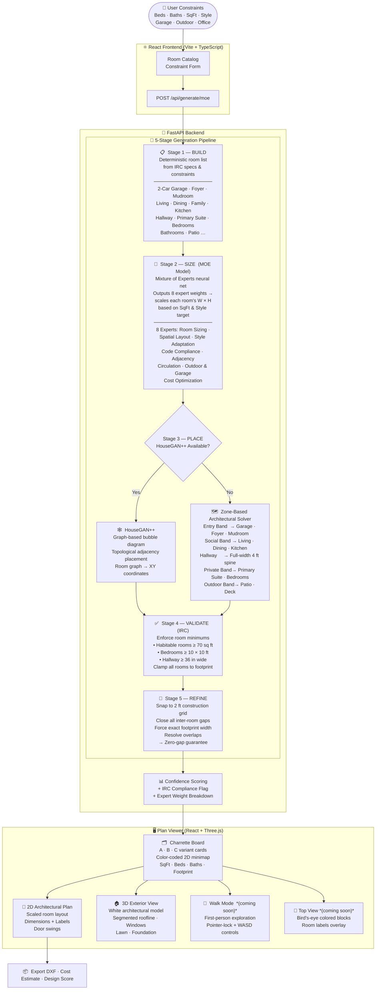

<div align="center">

# 🏗️ Buildify

### AI-Powered Residential Floor Plan Generator

<p align="center">
  
  
  
  
  
</p>

> **Buildify** turns a handful of home requirements — bedrooms, bathrooms, square footage, style — into multiple, ready-to-review architectural floor plans in seconds. Every plan is structurally sound, zero-gap, and compliant with US residential building codes.

</div>

---

## 🧭 What Is Buildify?

Buildify is an end-to-end AI platform for residential architectural design. It combines a locally trained **Mixture of Experts (MOE) neural network** for intelligent room sizing, **HouseGAN++ graph-based spatial topology**, and a **deterministic zone-based layout solver** to produce realistic, buildable floor plans — not hallucinated geometry.

Unlike pure generative approaches, Buildify's hybrid pipeline ensures every plan:
- Has **zero gaps** between rooms — rooms are packed edge-to-edge on a 2ft construction grid
- Respects **US IRC (International Residential Code)** minimums — e.g. 70 sq ft for habitable rooms
- Has **correct architectural proportions** — houses are 60–80 ft wide and 40–65 ft deep, not skyscraper towers
- Varies meaningfully across variants — different garage arrangements, room groupings, and outdoor configurations

---

## 🚀 What You Can Do With Buildify

| Use Case | Description |
|---|---|
| 🏡 **Instant Conceptual Design** | Enter beds, baths, sqft and style — get 3 distinct plan variants immediately |
| 📐 **Charrette Board Comparison** | Compare all generated plans side-by-side as architectural cards with 2D minimaps |
| 🔍 **Detailed 2D Review** | Click into any plan to examine a scaled, color-coded architectural floor plan with room labels and dimensions |
| 🏠 **3D Exterior Visualization** | Switch to a clean, white architectural 3D exterior with roof, windows, and lawn |
| 💬 **Design Consultation** | Use the integrated AI chat to ask questions about your plan, room sizes, or code requirements |
| 📦 **Export to CAD** | Export any plan as a `.dxf` file for import into AutoCAD or any professional CAD tool |
| 💰 **Cost Estimator** | Get a regional cost estimate based on your plan's sqft and room configuration |

---

## 🧠 System Architecture

Buildify uses a **5-stage hybrid generation pipeline**. The diagram below shows exactly how a user request flows from constraints to final plan:



---

## 🗂️ Project Structure

```
Buildify/
├── backend/
│   ├── main.py                  # FastAPI app — all API routes
│   ├── generator.py             # Deterministic floor plan generator
│   ├── scoring.py               # Design quality scoring
│   ├── cost.py                  # Regional cost estimator
│   ├── exporter.py              # DXF CAD export
│   ├── rag.py                   # RAG-based AI design chat
│   └── moe/
│       ├── model.py             # BuildifyMOE — PyTorch Mixture of Experts
│       ├── inference.py         # 5-stage generation pipeline
│       ├── data.py              # IRC room specs + training data synthesis
│       ├── experts.py           # 8 named expert definitions
│       ├── config.py            # MOE hyperparameters
│       ├── api_auth.py          # API key management
│       └── weights/
│           └── buildify_moe.pt  # Trained model weights
└── frontend/
    ├── src/
    │   ├── App.tsx              # Root layout + routing
    │   ├── App.css              # Design system + component styles
    │   ├── api/client.ts        # Typed API client (axios)
    │   ├── types/floorplan.ts   # Shared TypeScript types
    │   └── components/
    │       ├── ConstraintForm.tsx     # Room catalog sidebar
    │       ├── FloorPlanGallery.tsx   # Charrette Board (A/B/C cards)
    │       ├── FloorPlanPreview.tsx   # Color-coded 2D SVG minimap
    │       ├── ArchPlan.tsx           # Full 2D architectural plan renderer
    │       ├── View3D.tsx             # Three.js 3D visualization
    │       └── FloorPlanEditor.tsx    # Plan detail view + mode switcher
    └── vite.config.ts
```

---

## 🛠️ Tech Stack

| Layer | Technology | Purpose |
|---|---|---|
| **Frontend** | React 18 + Vite + TypeScript | UI framework |
| **3D Visualization** | Three.js / React Three Fiber | 3D exterior, walk mode |
| **2D Rendering** | SVG / Canvas (custom) | Architectural plan renderer |
| **Styling** | Vanilla CSS (custom design system) | Dark sidebar, Charrette Board |
| **Backend** | FastAPI (Python 3.11) | REST API layer |
| **AI Model** | PyTorch — Mixture of Experts | Room sizing intelligence |
| **Spatial Layout** | HouseGAN++ | Graph-based room placement |
| **Building Codes** | IRC 2021 (R304, R311.7) | Room minimums & compliance |
| **CAD Export** | ezdxf | DXF file generation |

---

## ⚡ Running Locally

### Backend
```bash
cd backend
pip install -r requirements.txt
python3 -m uvicorn main:app --host 0.0.0.0 --port 8002 --reload
# API docs available at http://localhost:8002/docs
```

### Frontend
```bash
cd frontend
npm install
npm run dev
# App available at http://localhost:5173
```

> The Vite dev server proxies all `/api/*` requests to `http://localhost:8002` automatically.

---

## 🏠 Example Plans

For a **3 bed · 2 bath · 1,800 sq ft · Modern** home, Buildify generates 3 variants:

| Variant | Dimensions | Rooms | Total Area |
|---|---|---|---|
| Plan A — Optimized | 68 W × 60 D ft | 17 rooms | 2,332 sq ft |
| Plan B — Balanced | 68 W × 62 D ft | 17 rooms | 2,352 sq ft |
| Plan C — Efficient | 68 W × 60 D ft | 17 rooms | 2,388 sq ft |

Each plan includes: 2-Car Garage · Mudroom · Laundry · Foyer · Living Room · Dining Area · Family Room · Kitchen · Pantry · Main Hallway · Primary Suite · Primary Bath · Primary Closet · 2× Bedroom · Shared Bath · Rear Patio

---

## 🗺️ Roadmap

- [x] MOE model training pipeline
- [x] HouseGAN++ integration with zone-based fallback
- [x] IRC compliance validation
- [x] Zero-gap layout guarantee
- [x] Charrette Board UI (A/B/C variant comparison)
- [x] 3D white architectural exterior
- [x] DXF CAD export
- [x] Regional cost estimator
- [ ] First-person 3D walkthrough (WASD + pointer lock)
- [ ] Top-view colored block mode (bird's-eye with room labels)
- [ ] Door/window placement in plans
- [ ] Multi-story support
- [ ] Direct integration with Autodesk, SketchUp, or Revit

---

## 📝 License

This project is open-source under the MIT License.

---

<div align="center">
Built with 🤖 AI + 📐 Architecture + 🏗️ Engineering
</div>
